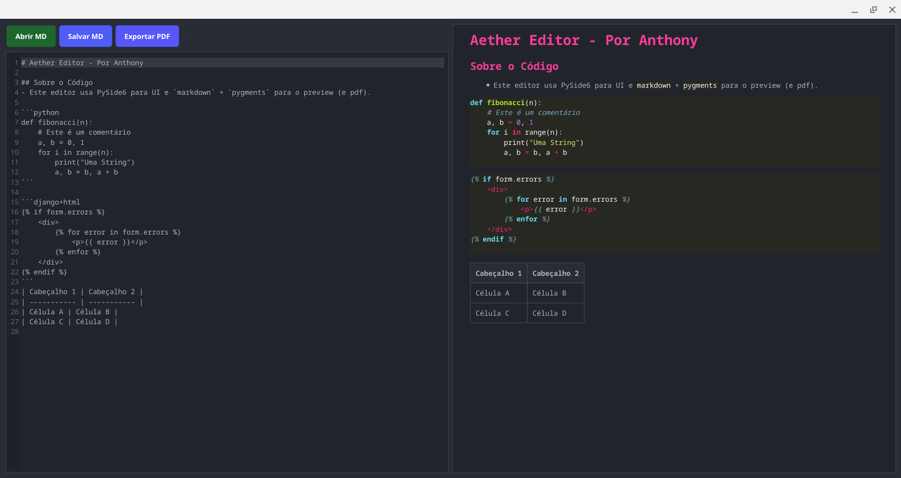

# Aether Editor


### crie documentos escrevendo markdown

#### funções já presentes:

- conversão e salvamento para documentos pdf.
- escrita de markdown.
- preview do resultado final.

## visualização:



## como baixar:

#### clone o repositório

```bash
git clone https://github.com/Anthony-Davi001 Aether-editor.git
```
#### instale as dependências:

```bash
pip install PySide6
pip install Pygments
pip install markdown
```

#### rode o arquivo `main.py`:

```
python3 main.py
```

